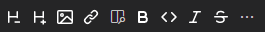

# Markdown Toolbar

An extension for Visual Studio Code that adds a toolbar for common markdown functionality to avoid having to remember specific characters or shortcuts.

## Features

This extension adds buttons to the notebook toolbar. It adds the following buttons:

- Increase Header Level
- Decrease Header Level
- Insert Image
- Insert Link
- Toggle Bold
- Toggle Code
- Toggle Italic

## Release Notes

See [CHANGELOG](CHANGELOG.md)

## Credits

Uses icons from [Octicons](https://primer.style/octicons/)
